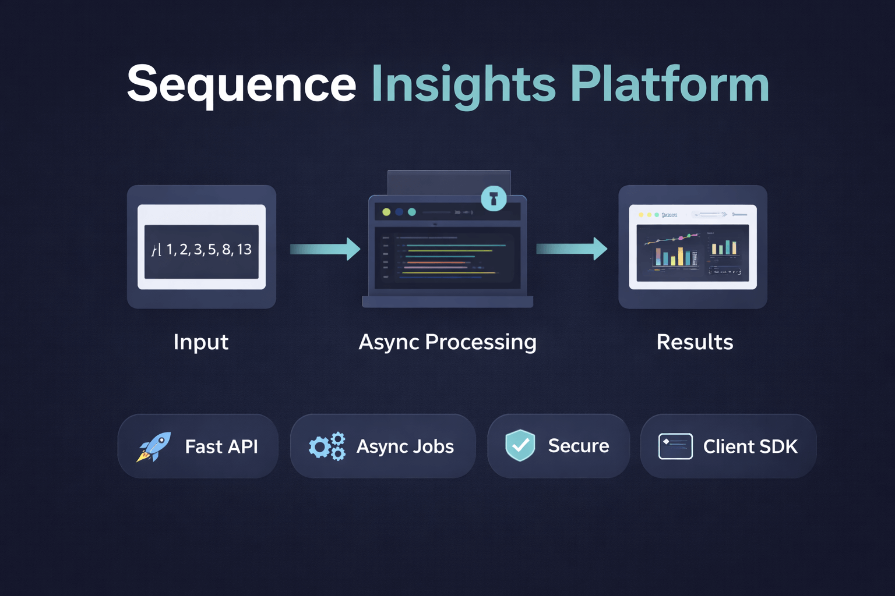

# Sequence Insights Platform

A small, production-shaped Go service for ingesting numeric sequences and computing basic metrics (with async post-processing).

- Go API + PostgreSQL
- Structured JSON logs
- Optional bearer-token auth
- Docker Compose for local dev

## Quickstart

```bash
cp .env.example .env
make docker-up
```

Health check:

```bash
curl http://localhost:8080/health
```

Ingest a sequence:

```bash
curl -X POST http://localhost:8080/v1/sequences/ingest \
  -H 'Content-Type: application/json' \
  -d '{"values":[3,-1,1,14]}'
```

## Docs

- API: `docs/api.md`
- Architecture: `docs/architecture.md`

## Repository layout

- `server/` Go API service
- `client/` lightweight clients (Go + Python)
- `docs/` design notes and API docs
